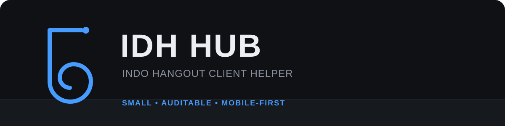

<p align="center">
  
</p>

<p align="center">
  
  
  
  
</p>

<p align="center">
  <a href="#fitur">Fitur</a> ·
  <a href="#menjalankan">Menjalankan</a> ·
  <a href="#validasi">Validasi</a> ·
  <a href="#repository-map">Repository</a> ·
  <a href="CONTRIBUTING.md">Contributing</a>
</p>

IDH Hub adalah client helper kecil untuk Indo Hangout. Runtime memakai GUI
native, tidak memuat UI library pihak ketiga, dan tetap tersedia sebagai satu
file agar mudah diperiksa sebelum dijalankan.

Implementasi saat ini dipetakan dari `IDH_COMPLETE_CLIENT_DUMP.rbxlx` tanggal
17 Agustus 2026. Itu membuktikan path dan perilaku client pada dump tersebut,
bukan kompatibilitas server tanpa batas.

## Fitur

| Modul | Perilaku |
|---|---|
| Auto Fishing | Cast melalui stock tool, deteksi GUI reeling, pointer assist Android, fallback Space |
| Fast Catch | Direct catch request opsional bila input assist tidak cocok |
| Auto Mining | Pathfinding terbatas, batas jarak/tinggi, dan cooldown target gagal |
| Copy Avatar | `HumanoidDescription` melalui apply remote yang dipakai client |
| Inventory | Sell fish/crystal berdasarkan kategori yang sudah dimuat GUI game |
| Utility | Anti-AFK, low graphics lokal, compatibility scan |

Build 0.4.0 memperbaiki mini-game fishing yang berhenti di layar
`Hold & Click Screen`. Stock client menerima klik/touch selain Space. Hub kini
mengirim pointer input lebih dulu, mempertahankan Space sebagai fallback, dan
mulai membantu saat GUI reel terlihat meskipun event remote terlewat.

## Menjalankan

1. Masuk ke Indo Hangout dan tunggu karakter selesai spawn.
2. Pastikan fishing rod atau pickaxe berada di Backpack.
3. Buka Delta Executor dan jalankan loader berikut satu kali.

```lua
loadstring(game:HttpGet("https://raw.githubusercontent.com/amarnazhan27-gif/IDHscrip/main/NazhanHub.lua", true))()
```

Mulai Auto Fishing dengan `Fast Catch` mati. Saat mini-game muncul, WhiteBar
seharusnya bergerak bolak-balik mengikuti RedBar. Gunakan Fast Catch hanya jika
pointer assist tidak diterima oleh versi executor yang dipakai.

File entry point terpisah tetap tersedia:

- `autofish.lua` membuka hub dan langsung menyalakan fishing.
- `automining.lua` membuka hub dan langsung menyalakan mining.
- `copyavatar.lua` mengembalikan fungsi copy avatar.

## Validasi

Static audit:

```bash
./scripts/audit.sh
```

Safe scan dari Delta:

```lua
local hub = loadstring(game:HttpGet("https://raw.githubusercontent.com/amarnazhan27-gif/IDHscrip/main/NazhanHub.lua", true))()
hub.runSelfTest()
```

Active fishing/mining test dapat menggerakkan karakter dan mengirim request:

```lua
hub.runSelfTest({active = true, fishingWait = 25, miningWait = 10})
```

`PASS` pada scan berarti dependency atau path client tersedia. Reward belum
terbukti sampai perubahan inventory atau cash terlihat di game. Prosedur lengkap
ada di [docs/validation.md](docs/validation.md).

## Client protocol

| Fitur | Path atau protocol |
|---|---|
| Cast | stock `Tool:Activate()` → `Rod("Throw")` |
| Reeling | `PlayerGui.Reeling.MainFrame.Frame.WhiteBar/RedBar` |
| Catch | stock client → `Rod("Catch", "Catch")` |
| Mining | stock `Tool:Activate()` → `Pickaxe("Hit")` |
| Crystal | `Workspace.MapContent.Decoration.Crystals` |
| Copy avatar | `BloxbizRemotes.CatalogOnApplyToRealHumanoid` |

Lihat [docs/protocol.md](docs/protocol.md) untuk pemetaan dan batas buktinya.

## Repository map

```text
IDHscrip/
├── NazhanHub.lua          # runtime utama, single-file
├── autofish.lua           # thin fishing entry point
├── automining.lua         # thin mining entry point
├── copyavatar.lua         # thin avatar entry point
├── assets/                # identitas visual repo
├── docs/                  # protocol dan panduan validasi
├── evidence/              # manifest bukti tanpa dump/screenshot mentah
└── scripts/               # static audit yang dapat diulang
```

Struktur mengikuti prinsip AURUM yang relevan: source mudah ditemukan, bukti
dipisahkan dari klaim, dan pemeriksaan dapat diulang. Folder MT5 seperti profile
dan checksum tidak disalin karena tidak memiliki fungsi pada runtime Luau ini.

## Troubleshooting

Build yang berhasil dimuat menampilkan notifikasi `Build 0.4.0` dan console
`[IDH Hub 0.4.0] starting` lalu `loaded`. Error game lain tidak berasal dari hub
jika tidak memiliki prefix tersebut.

Jika mini-game masih diam:

1. Buka tab `System` dan jalankan compatibility scan.
2. Pastikan hasil `Reel input adapter` muncul.
3. Tutup UI Delta agar sentuhan tidak ditangkap overlay executor.
4. Ulangi dengan Fast Catch mati dan rekam console `[IDH Test]`.

## Batasan

- Update game dapat mengganti object, payload, atau server validation.
- Automation dapat melanggar aturan game/platform dan berisiko membatasi akun.
- Gunakan akun uji. Repo tidak menjamin reward, kompatibilitas 100%, atau bebas ban.
- Repo tidak membutuhkan webhook, token, password, atau telemetry.

## License

MIT. Lihat [LICENSE](LICENSE).
